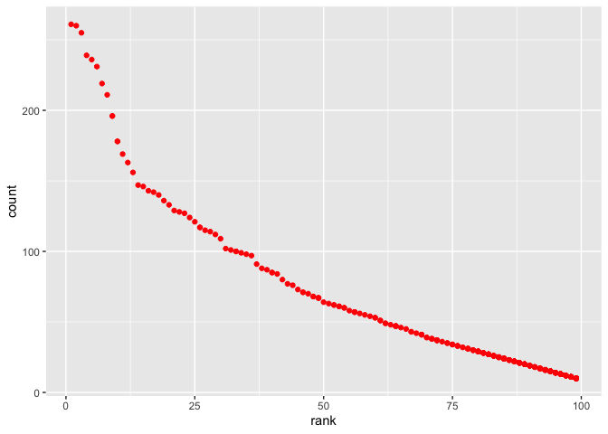

p8105\_hw2\_yl4928
================
Rachel
10/3/2021

``` r
library(tidyverse)
library(readxl)
```

## Problem 1

# Read and clean the Mr. Trash Wheel sheet

# omit rows that do not include dumpster-specific data

``` r
mtw_df = 
  read_excel("./data/Trash-Wheel-Collection-Totals-8-6-19.xlsx", range = "A2:N408") %>% 
  janitor::clean_names() %>% 
  na.omit() %>% 
  mutate(sports_balls = round(sports_balls))
```

Read and clean precipitation data for 2018 and 2019. For each, omit rows
without precipitation data and add a variable for year. Next, combine
precipitation datasets and convert month to a character variable (the
variable month.name is built into R and should be useful).

``` r
precipitation_2018_df = 
   read_excel(
     "./data/Trash-Wheel-Collection-Totals-8-6-19.xlsx",
   sheet = "2018 Precipitation",
   range = "A2:B14") %>% 
janitor::clean_names() %>%
drop_na(total) %>%
mutate(year = 2018)
```

``` r
precipitation_2019_df = 
    read_excel(
      "./data/Trash-Wheel-Collection-Totals-8-6-19.xlsx",
    sheet = "2019 Precipitation",
    range = "A2:B14") %>% 
janitor::clean_names() %>% 
drop_na(total) %>% 
  mutate(year = 2019)
```

# combine precipitation datasets and convert month to a character variable

``` r
precipitation_df = 
  bind_rows(precipitation_2018_df, precipitation_2019_df) %>%
  janitor::clean_names() %>% 
  mutate(month = month.name[month])
```

Write a paragraph about these data

There are 344 observations in the Mr. Trash Wheel sheet. There are 18
observations in the combined precipitation datasets of 2018 and 2019.
Examples of key variables include `month` and `year`. The total
precipitation in 2018 is 70.33. The total precipitation in 2019 is
16.67. The median number of sports balls in a dumpster in 2019 is 8.5.

## Question\_2

# part\_a.

clean the data in pols-month.csv. Use separate() to break up the
variable mon into integer variables year, month, and day replace month
number with month name create a president variable taking values gop and
dem, and remove prez\_dem and prez\_gop and remove the day variable.

``` r
polsmonth_df = 
  read_csv("./data/fivethirtyeight_datasets/pols-month.csv") %>% 
  janitor::clean_names() %>% 
  separate(mon, into = c("year", "month", "day")) %>% 
  mutate(month = as.integer(month),
         month = month.name[month],
         year = as.numeric(year),
         president = ifelse(prez_gop == 0, "dem", "gop")) %>% 
  select(-prez_dem & -prez_gop & -day)
```

# Part\_b

clean the data in snp.csv using a similar process to the above. For
consistency across datasets, arrange according to year and month, and
organize so that year and month are the leading columns.

``` r
 snp_df = 
  read_csv("./data/fivethirtyeight_datasets/snp.csv") %>% 
  janitor::clean_names() %>% 
  mutate(date = lubridate::mdy(date)) %>% 
  separate(date, into = c("year", "month", "day")) %>% 
  mutate(year = as.integer(year),
         month = as.integer(month),
         day = as.integer(day),
         month = month.name[month]
         ) %>% 
  arrange(year, month) %>% 
  relocate(year, month)
```

# Part\_3

tidy the unemployment data so that it can be merged with the previous
datasets. This process will involve switching from “wide” to “long”
format; ensuring that key variables have the same name; and ensuring
that key variables take the same values.

``` r
unemployment_df = 
  read_csv("./data/fivethirtyeight_datasets/unemployment.csv") %>% 
  janitor::clean_names() %>%
  pivot_longer(
    jan:dec,
    names_to = "month", 
    values_to = "unemployment_rate"
    ) %>% 
  mutate(year = as.numeric(year)) %>% 
    na.omit()
```

Join the datasets by merging snp into pols, and merging unemployment
into the result

``` r
merge_df =
  left_join(polsmonth_df, snp_df, by = c("year", "month")) %>%
  left_join(unemployment_df, by = c("year", "month"))
```

Write a short paragraph about these datasets. Explain briefly what each
dataset contained, and describe the resulting dataset (e.g. give the
dimension, range of years, and names of key variables).

There are 822 observations in `polsmonth_df`. There are 9 variables in
`polsmonth_df`. There are 787 observations in `snp_df`. There are 4
variables in `snp_df`. In the `unemployment_df`, there are 810
observations and 3 variables. By merging snp into pols, and merging
unemployment into the result, there are 822 observations and 12
variables.

## Question 3

Load and tidy the data.

``` r
PopularBaby_df = 
  read_csv("./data/Popular_Baby_Names.csv") %>%
  janitor::clean_names() %>% 
  mutate(
    gender = tolower(gender),
    ethnicity = tolower(ethnicity)) %>% 
  distinct()
```

Produce a well-structured, reader-friendly table showing the rank in
popularity of the name “Olivia” as a female baby name over time

``` r
olivia_df = 
  filter(PopularBaby_df, childs_first_name == "Olivia" & gender == "female") %>% 
  select(-"count") %>% 
  pivot_wider(
    names_from = "year_of_birth",
    values_from = "rank"
  ) %>%
  knitr::kable()
```

Produce a similar table showing the most popular name among male
children over time.

``` r
popularmalename_df =
  filter(PopularBaby_df, gender == "male", rank == 1) %>%
  select(-"count", -"rank") %>% 
  pivot_wider(
    names_from = "year_of_birth",
    values_from = "childs_first_name"
  ) %>%
knitr::kable() 
```

# a scatter plot showing the number of children with a name (y axis) against the rank in popularity of that name (x axis)

``` r
whitenonhispanic_df = 
  filter(
    PopularBaby_df, 
    gender == "male" & ethnicity == "white non hispanic" & year_of_birth == 2016)

ggplot(whitenonhispanic_df, aes(x = rank, y = count, color = species)) + geom_point(color = "red")
```

<!-- -->
